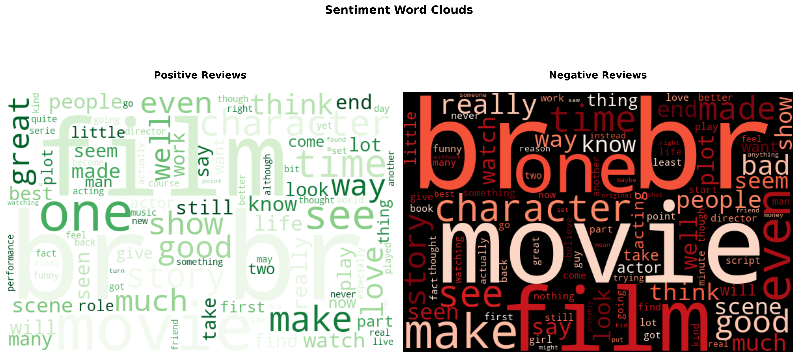
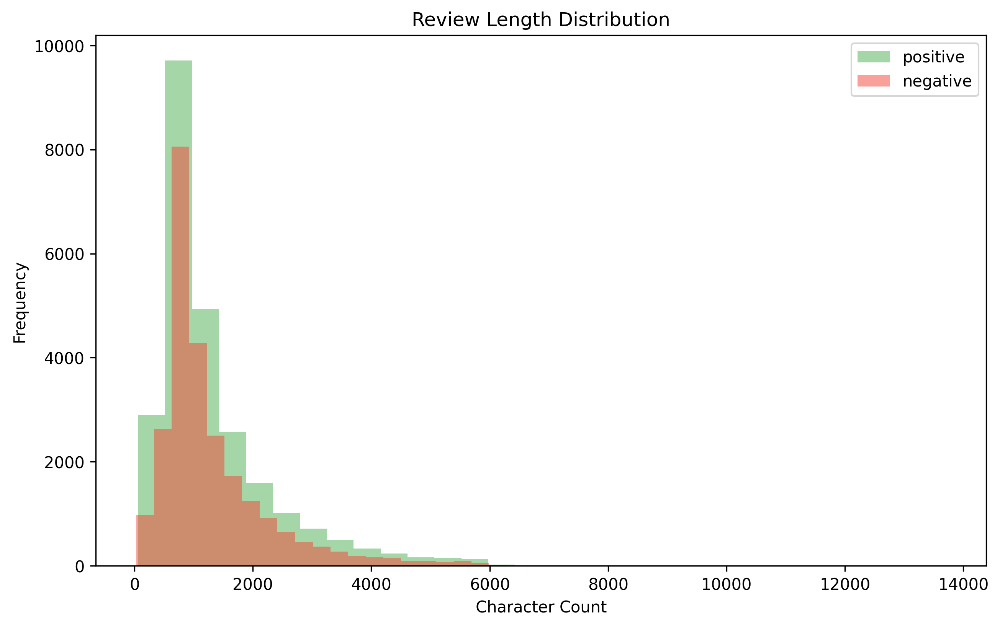

# 🎥 IMDB Top 5000 Movies Reviews Analysis
This project analysis IMDB Top 5000 Movies Reviews for KODAQS Assignment.

## Files
- imdb.ipynb: Jupyter Notebook script
- run.sh: Bash script to execute the Jupyter Notebook Script
- Figures: Folder with the code figures

## Reproducibility Setup
1. Clone repo:
`git clones https://github.com/isazeberio/kodaqs-imdb.git`
2. Virtual Environment 
`python -m venv imdb_venv`
`source imdb_venv/bin/activate`
3. Install Dependencies 
`pip install -r requirements.txt`
4. Run Analysis Pipeline
`./run.sh`

## Data Source
- **Main Dataset**: [IMDB 50K Movie Reviews](https://www.kaggle.com/datasets/lakshmi25npathi/imdb-dataset-of-50k-movie-reviews) (CC0: Public Domain)

## 📊 Figures 

*Most frequent words in positive and negative reviews (generated automatically)*

*Length distributioin of positive and negative reviews*